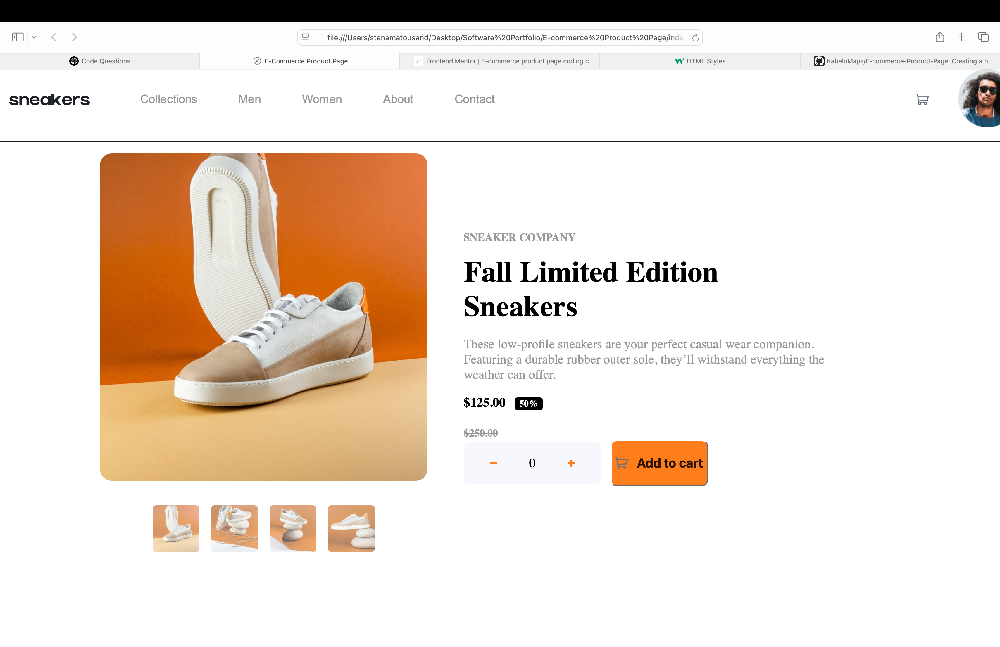

# Frontend Mentor - E-commerce product page solution

- This is a solution to the E-commerce product page challenge on Frontend Mentor

### The challenge

Users should be able to:

- View the optimal layout for the site depending on their device's screen size
- See hover states for all interactive elements on the page
- Open a lightbox gallery by clicking on the large product image
- Switch the large product image by clicking on the small thumbnail images
- Add items to the cart
- View the cart and remove items from it

### Screenshot

### Links

- Live Site URL: https://product-display-page.netlify.app
- Challenge URL: https://www.frontendmentor.io/challenges/ecommerce-product-page-UPsZ9MJp6

## My process

- My process is centered around attempting to build each UI component separately.
-

### Built with

- Desktop First Workflow
- Flexbox

### What I learned

- Implementing JavaScript for the add to cart functionality

### Continued development

- I'm still unfamiliar with states in css
